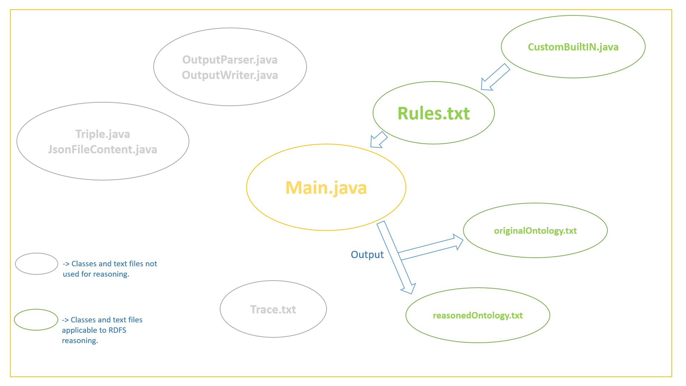

# RDFS Semantic Reasoner

### Contributers:
Brayden Pankaskie

### Purpose:
This Java RDFS reasoner was designed to be flexible, custamizable, scalable, and simple to understand.  It was built to accept a wide variaty of linked data and be able to present this data in a human readable form.

### Functions and Features:
* Accept and parse linked data of diverse rdf syntax and ontologies, storing then as a querable graph.
* Convert any linked data graph to desired syntax.  (Turtle, N-Triples, NQuads, TriG, JSON-LD, RDF/XML, RDF/JSON, TriX, RDF Binary)
* Reason over linked data using comletely customized rule-set in forward, backward, or hibrid chaining.
* Create an accurate inference graph which is a full RDFS entailment of the original graph based on the RDFS entailment lema from the W3C website.
    
## Design Overview

#### Other Helpful Documenation
* [Apache Jena Documentation](https://jena.apache.org/documentation/)
provides direction on how to use Jena, an API which contains many semantic tools and methods.
* [W3C Documentation](https://www.w3.org/TR/rdf-mt/#rules)
provides all rules, entailment lemas, and standards which must be adhered to.

